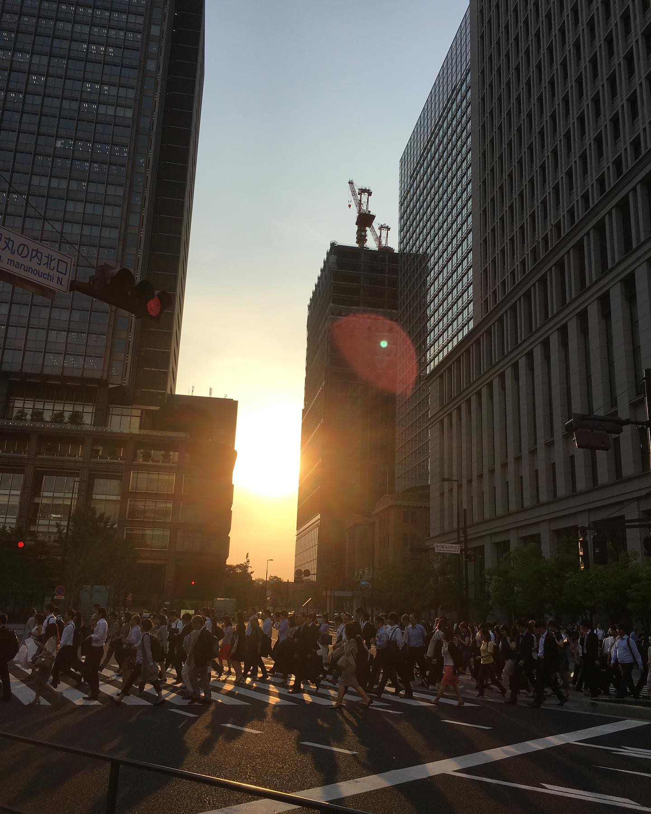
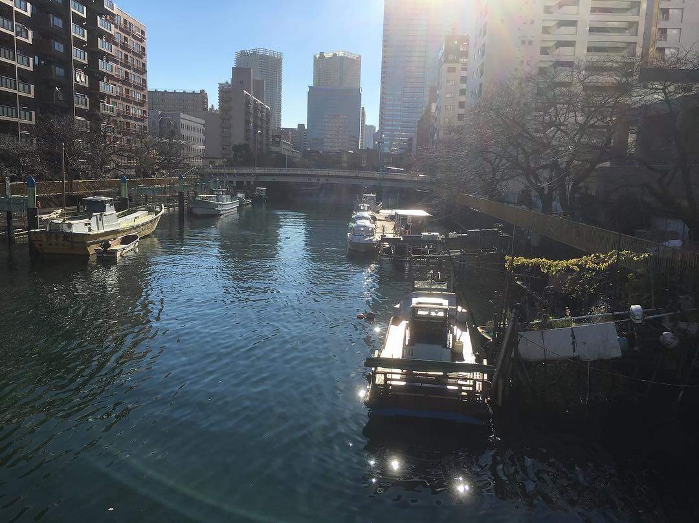
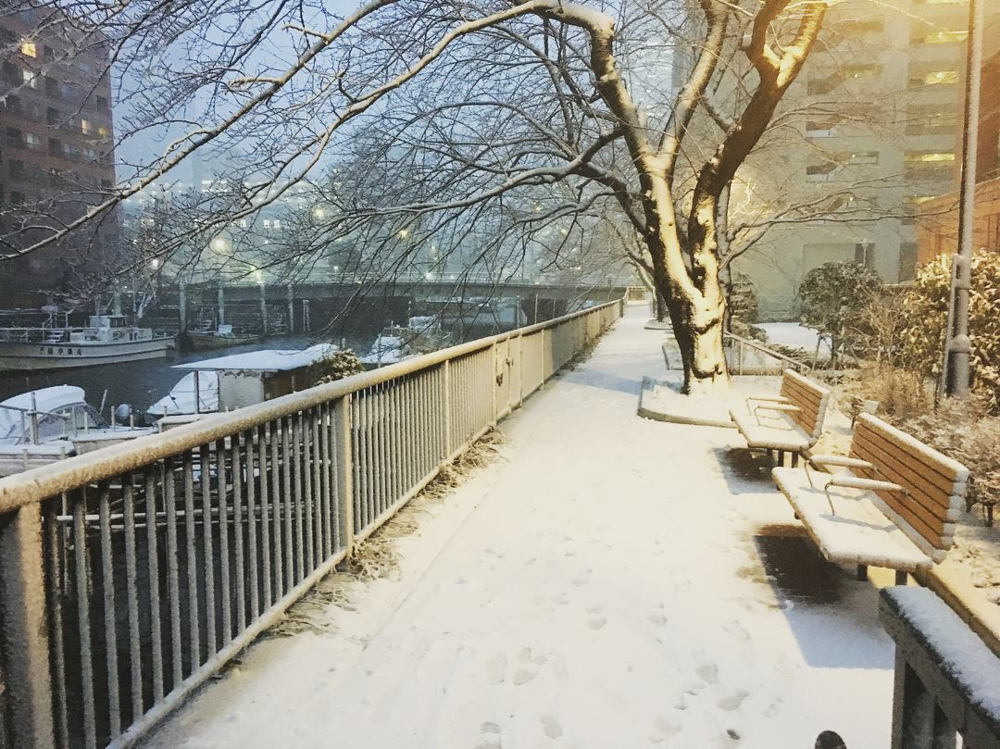
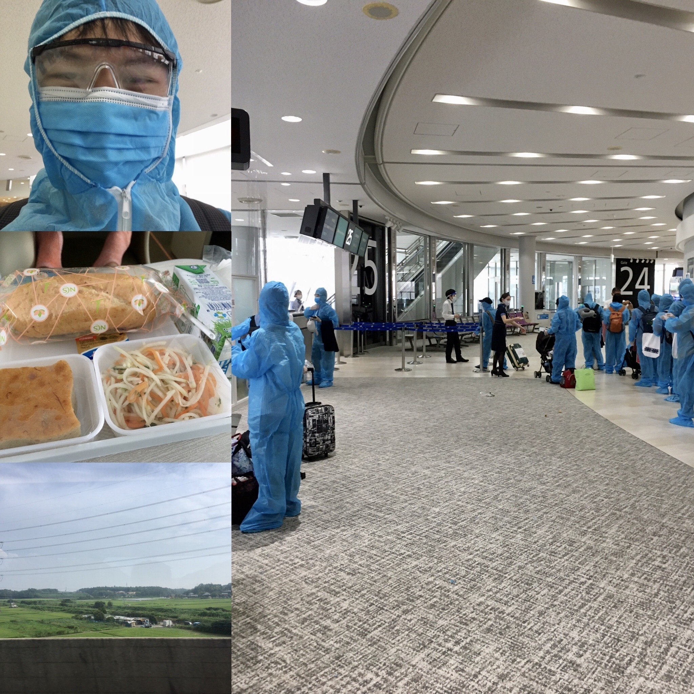
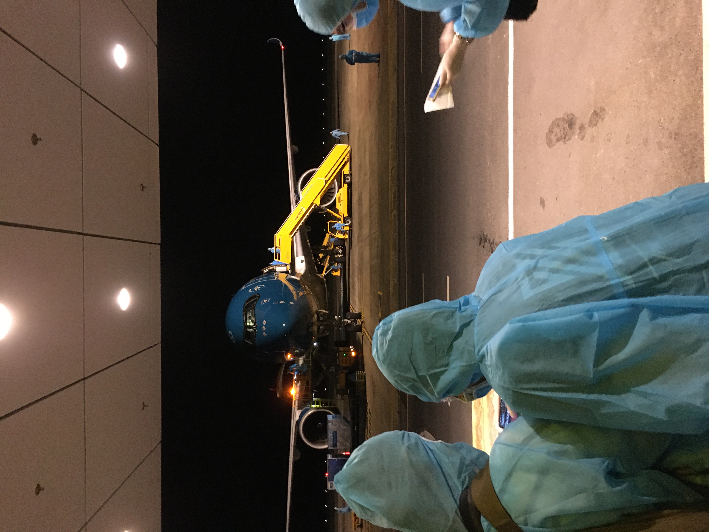
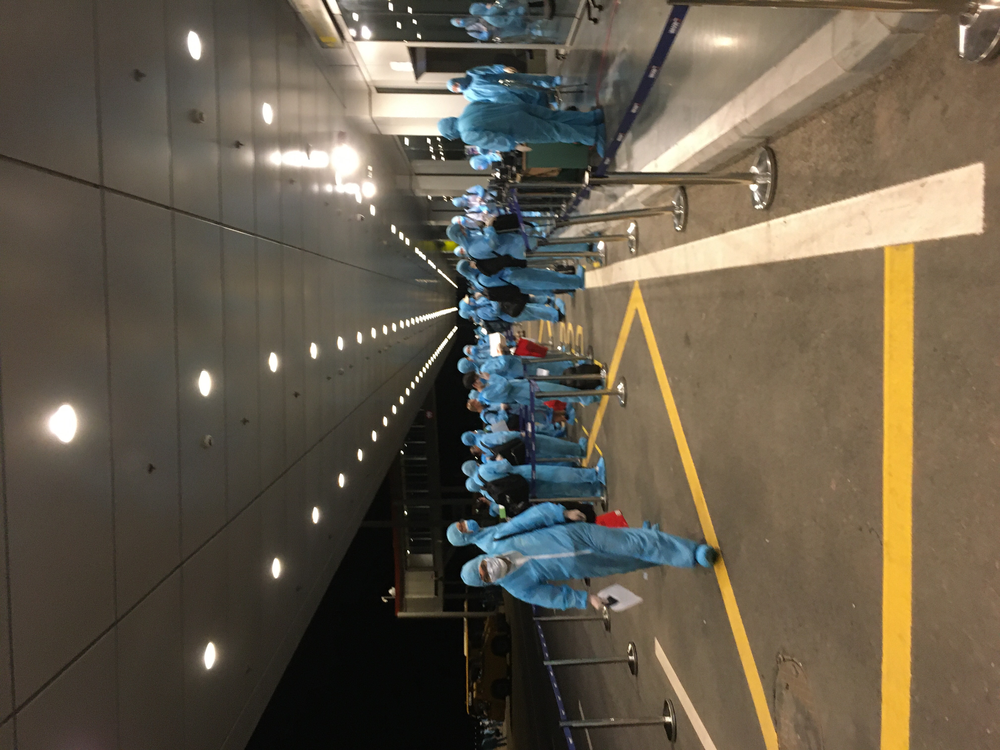
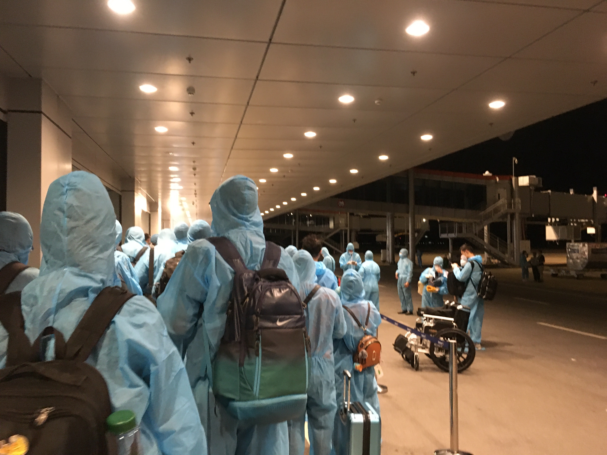
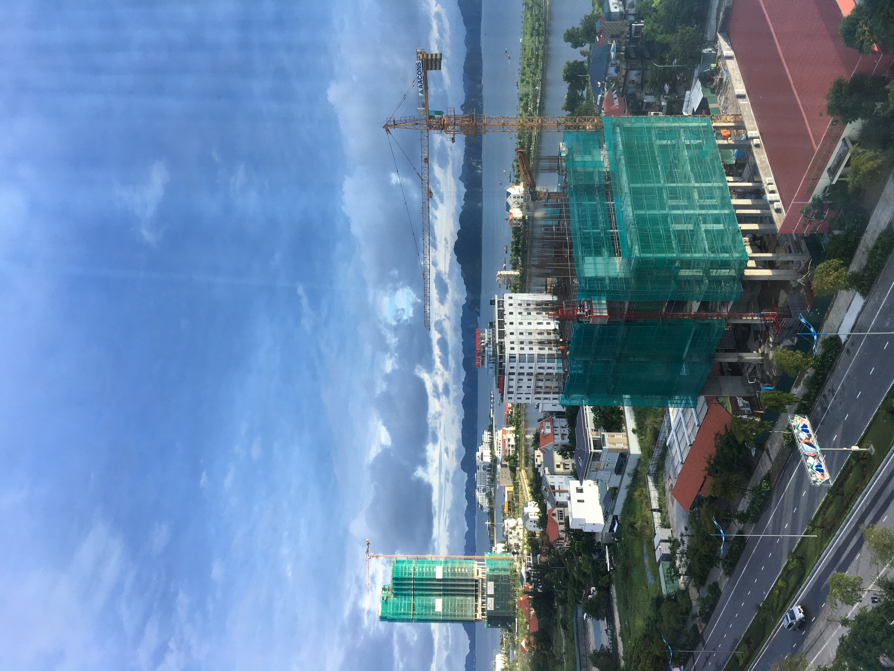

# Hồi ký Cách Ly 2020

Năm 2020, tháng 8, ngày 27.

## Bối cảnh

Một ngày tháng 8, một ngày hè oi ả của đất Nhật Bản, mùa của những chuyến du ngoạn, nhưng đó là trước Codvid-19.

Tôi còn nhớ, cái hè 4 năm trước, lần đầu tiên tôi đặt chân đến đất nước này. Lạ nước lạ cái, cái gì cũng không biết, ngay cả xem bản đồ, đi chợ, nấu đồ ăn như thế nào. Bởi thế mà khi rời khỏi nơi đây, tôi nhớ những ngày tháng ấy lắm.

Giữa mùa Covid-19 đang căng thẳng, Nhật ngày nào cũng công bố số người nhiễm mới một ngày vượt ngưỡng 1000 ca trong nhiều tuần liên tiếp. Việt Nam hạn chế nhập cảnh từ các quốc gia khác do năng lực cách ly không thể đáp ứng được nhu cầu về nước. Ở Đại sứ quán Việt Nam tại Tokyo, hàng dài những bạn trẻ mất việc, không có thu nhập, không có chỗ ở tập chung trước cổng Đại sứ quán treo những biểu ngữ như: `Chúng tôi muốn về nước`, `Chúng tôi không có việc`... Có nơi, các du học sinh, thực tập sinh phải tá túc ở ngôi chùa vì không còn khả năng trả tiền nhà.

Lần này tôi muốn về nước hẳn do lý do cá nhân. Nên ngay khi tôi nghe tin có chuyến bay đưa các kỹ sư IT về nước của `Hiệp hội phần mềm và dịch vụ Công nghệ thông tin Việt Nam`, viết tắt là `VINASA`, tôi vừa mừng vừa lo vì thời gian chuẩn bị rất gấp. Từ ngày hay tin đến ngày bay cách đúng 1 tuần. Tuy nhiên 2 ngày sau, tôi mới được xác nhận là có trong danh sách được phép bay và ... 2 ngày tiếp theo tôi mới hoàn thành xong việc mua vé. Vậy là còn 3 ngày chuẩn bị rời một nơi mình đã gắn bó. Chưa hết, dự án tôi đang làm đang chậm tiến độ đề ra và `căng như dây đàn`, đó là còn chưa kể tới đống đồ đạc lên tới 50kg chưa dọn xong. Với chút thời gian như vậy, tôi chỉ kịp nói lời tạm biệt với người bạn người Nhật từ hồi còn là sinh viên. Phải nói thêm rằng, những ngày này ra ngoài đường cũng đồng nghĩa với việc mạo hiểm sức khoẻ và công việc của mình với Covid-19. Chính vì thế mà hầu hết bạn vè, đồng nghiệp đều không thể gặp mặt chia tay được..

## Ngày về

Cuối cùng thì ngày về Việt Nam đã tới, tôi xuất phát từ nhà tới sân bay Narita trước giờ bay khoảng 2.5 giờ. Vì đồ ký gửi và sách tay rất nặng nên thằng bạn ở cùng xung phong vác hộ đồ cho tôi. Hệ thống tàu điện ngầm của Nhật Bản rất phức tạp nên càng vác nặng càng mất thời gian. Tàu nào cũng vắng tanh do Covid-19. Tôi đoán trong các công ty lớn, sau các công ty lữ hành, hàng không thì thiệt hại thứ nhì là các công ty tàu điện. Tôi chọn phương tiện là tàu tới thẳng sân bay Narita. Tàu này không dừng và rất đúng giờ nên tôi khá tự tin là không bị muộn. Nếu chọn xe bus thì đã có nhiều trường hợp trễ chuyến do giờ cao điểm thì một số nút giao thông cũng có tắc đường. Đi tàu thường, tức là tàu đi được 7 phút lại dừng rẻ hơn nhưng cũng có khả năng bị chậm do tai nạn trên đường ray mà chủ yếu là có người nhảy tàu tự sát. Thật đáng sợ đúng không, thật đáng buồn là ở Nhật chuyện đó xảy ra rất nhiều.

Cùng đi với tôi theo đoàn `Kaopiz` là mẹ của anh Huân và một cậu BrSE công ty mới tậu được tên là Lâm. Tới sân bay checkin xong xuôi, tôi cùng mọi người bước vào khu vực lên tàu bay. Có thể vì số chuyến bay hiện tại rất ít nên hành lý được soi rất kỹ, mọi thứ khả nghi đều được sếp riêng và nhân viên sẽ gọi chủ sở hữu mở túi ra xác nhận. Với những người có tư cách lưu trú dài hạn (từ 1 năm trở lên) thì được yêu cầu làm giấy huỷ tư cách lưu trú, tức là nếu muốn quay lại Nhật thì lại phải làm thủ tục mới. Khá tiếc cho cậu BrSE đi cùng vì hạn Visa còn những 5 năm nữa mà đã bị `đục lỗ`.

Tới lối ra máy bay, nhân viên sẽ cung cấp cho tất cả mọi người đồ bảo hộ hệt như các y bác sĩ đối mặt với Covid-19 hằng ngày trên tin tức vậy. Đồ bảo hộ bao gồm cả gang tay, bao giầy dép, chỗ duy nhất hở ra đó là phần chán và phía trên sống mũi. Giờ thì tôi nhận ra một điều là đã lạc mất 2 đồng đội đi cùng vì không thể nào phân biệt được ai với ai nữa. Còn dựa vào đặc điểm của đồ sách tay thì đã quá muộn, trước đó tôi không hề để tới chúng. Ngay sau đó, loa sân bay gọi tên tôi, hoảng hồn vì lo lại có vấn đề gì về hành lý đúng lúc lên máy bay, tôi vội chạy ra chỗ nhân viên. Chẳng hiểu sao họ lại đổi cho tôi một tấm vé khác, lúc lên máy bay mới biết hoá ra đó là vé hạng thương gia. Chẳng hiểu sao lại được vé hạng sang, tôi nghĩ có lẽ là do phải đảm bảo khoảng cách trên máy bay nên mình may mắn được ngồi chỗ thoải mái. Đến lúc này thì thực sự đã lạc bác và Lâm. Đồ ăn trên chuyến bay VietnamAirlines này chỉ là bánh mì, sữa, ít rau và 2 trai nước lọc. Có lẽ hãng bay đã chịu nhiều chi phí, số hành khác ít hơn các chuyến bay thương mại thông thường để đảm bảo an toàn nên đồ ăn mới khiêm tốn vậy.

## Hạ cánh

Trên chuyến bay này, hạng thương gia chỉ khác với hàng ghế thường là khả năng nằm duỗi thẳng chân. Điều đó giúp tôi ngủ khá thoải mái trên chuyến bay kéo dài dự kiến 5h 40 phút bắt đầu lúc 17h giờ Nhật, đến 20h 40 giờ Việt Nam. Do địa điểm hạ cách là sân bay Vân Đồn - Quảng Ninh, máy bay hạ cánh sớm hơn dự kiếm khoảng 30 phút. Sân bay Vân Đồn khá khiêm tốn về diện tích. Tất cả thủ tục nhập cảnh tiến hành ngoài trời do virut kị không gian thoáng khí. Tất cả hành lý được phun khử trùng. Tôi cứ đứng chờ xem có ai hao hao giống bác và Lâm suốt 1 tiếng rưỡi nhưng vô vọng. Về sau Lâm có nói là nó cũng vậy, hoá ra 2 anh em đứng cùng 1 chỗ suốt mà không hề nhận ra nhau. Tới khoảng 10 giờ tối, tất cả thủ tục mới hoàn tất. Giờ thì đoàn người chia làm 2. Đoàn số 1 là đoàn liên quan tới công ty FPT, tức là đoàn đi theo dạng hiệp hội `VINASA`. Còn đoàn số 2 không liên quan tới `VINASA`, do chuyến bay còn thừa chỗ nên những người muốn về nước đi theo đoàn này. Đoàn 1 thì sẽ tới khách sạn 4 sao cách ly có tính phí khoảng 21 triệu. Tôi cũng không hiểu sao cần phải cách ly ở một nơi tốn kém như vậy. Còn đoàn 2 sẽ cách ly theo phương thức thông thường, tức là trong doanh trại quân đội ở Hải Phòng. Đến đây đã có 1 điều tồi tệ đã xảy ra.

Người dẫn đoàn hỏi "Bạn có phải đi theo đoàn FPT không?". Tôi thì nghĩ mình không phải công ty này nên đi theo đoàn số 2. Đến nửa đường đi về phía doanh trại Hải Phòng, tôi mới bắt chuyện với người ngồi cạnh thì mới biết đoàn mà mình đang đi cùng chẳng ai mất phí cách ly cả. Tức là đoàn mà tôi cần đi là đoàn FPT cơ. Cũng có lẽ người phụ trách đoàn này là thuộc công ty FPT nên họ gọi luôn như vậy. Tôi phải tới doanh trại quân đội ở Hải Phòng để lấy hành lý rồi mới quay lại. Tới doanh lúc 12h đêm, các anh bộ đội phun khử khuẩn cả xe đưa đón và làm thủ tục xong cho 136 người, sau đó hành lý mới được dỡ xuống. Vấn đề là tôi không biết hành lý mình nằm ở đâu trong đống hành lý được chuyên trở bằng 2 xe tải quân sự cỡ lớn. Chỉ còn cách giúp các chú bộ đội thật nhanh dỡ hành lý để lấy đồ trong khi chiếc xe 32 đến đón tôi đang chờ đợi. Đi cùng xe tới từ khách sạn là 1 cậu đưa nhầm hành lý lên xe quân sự, cậu ta tới để lấy hành lý mình mình. Cậu ta cũng giúp 1 tay trong việc dỡ đồ. Tìm được hành lý cũng là lúc 3 giờ sáng, cả chiếc xe 32 chỗ chở 2 người quay về khách sạn tận thành phố Hạ Long. Do phải đảm bảo cách ly và hạn chế tiếp xúc gần, chiếc xe đưa đón hành khách được tái sử dụng chứ không phải là 1 chiếc taxi thông thường. Đến nửa đường, cậu đi cùng chợt nhớ ra để quên điện thoại trên thùng xe quân sự. Cậu ta muốn quay lại Hải Phòng lúc 3 giờ sáng. Cũng may là cậu ta chịu nghe tôi, lấy điện thoại bằng cách khác sau. Cuối cùng cũng về tới khách sạn khoảng 3h 30 sáng.

## 14 ngày cách ly tập chung

Sau khi lên phòng tôi thấy Lâm ra mở cửa. Lâm bảo vẫn lơ mơ chưa ngủ, cũng tại tôi mãi mới tới khách sạn. Phòng có 2 giường cho mỗi người và khá rộng. Sáng hôm sau tôi xin nghỉ vì thiếu ngủ. Kể từ đó tôi làm remote đến hôm rời khách sạn. Ngày hôm sau, tôi phải trả phí khá cao cho chuyến đi nhầm tối qua. Điều đáng nói là cậu bạn đi cùng lúc đầu không chịu trả tiền mà muốn tôi trả hết với lý do là tiện xe tới đón tôi nên đi nhờ tôi chứ hành lý đó cậu ta vứt bỏ cũng được. Tôi thì nghĩ, lên xe buýt nói với tài xế y như vậy rồi không trả tiền liệu có được không? Và nếu đi nhờ thì cậu ta còn chưa xin phép tôi được lên xe. Nói một hồi đôi co những lý do không liên quan như phải tìm tôi suốt từ lúc lên xe thì chị phụ trách đoàn mới đồng ý tôi đóng 80% còn cậu ta đóng 20%.

Thành phố Hạ Long khá nhỏ, từ cửa sổ nhìn ra được Vịnh Hạ Long cùng với đảo Tuần Châu. Đồ ăn khá ngon, hầu hết là hải sản. Bọn tôi được đo thân nhiệt 2 lần 1 ngày. Xét nghiệm 2 lần đều có kết quả âm tính. 1 lần là lấy dịch ở cổ họng, 1 lần là lấy dịch ở mũi. Cảm giác bị thọc sâu vào mũi khá là khủng khiếp đối với tôi.

Sau 14 ngày chỉ có gọi điện cho vợ và làm việc thì tôi được thả về với xã hội. Tiếp tục cách ly tại nhà thêm 2 tuần. Cuối cùng thì tôi cũng đã được thưởng thức bữa cơm do vợ nấu.

