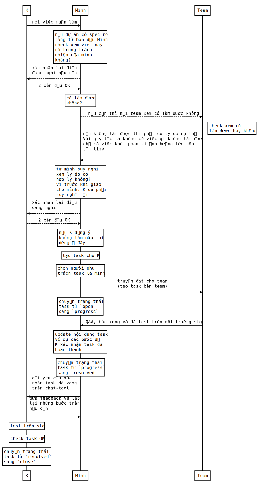
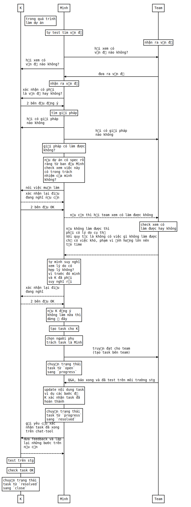

# workflow khi làm BrSE

## Mở đầu

Về đặc thù của vị trí `BrSE` bạn có thể `google` để biết thêm. Trong các bài viết đó thì bài viết [này](https://itviec.com/blog/ky-su-cau-noi-la-gi/) giới thiệu mình thấy khá là dễ hiểu.

Với kinh nghiệm làm `BrSE` dự án đầu tiên ăn hành tỏi thì bài viết chỉ mang tính tự thuật và mang cho người ngoài ngành cái nhìn rõ hơn 1 chút về nghề này.

Còn đối với các bạn mới làm `BrSE` thì theo mình nghĩ các bạn nên tự mình trải nghiệm.

Bài viết đưa ra `workflow` của cá nhân mình, có thể chưa phù hợp, chưa đúng thì mong các bạn comment để mình học hỏi thêm.

## workflow là gì

Dịch sang tiếng Việt thì là `luồng công việc` hoặc `quy trình`.

Các ví dụ về `luồng công việc` như:
- các bước để tán gái
- các bước để hút thuốc lào đúng cách
- các bộ phận logic trong 1 cái máy
- các quy trình khi sử dụng git với team
- ...

workflow cũng có tính tương đối đúng sai và khi sử dụng không nên quá cứng nhắc.

## workflow để làm gì

- tránh gây ra những thiệt hại không đáng có khi làm việc
- giúp quá trình diễn ra dễ tự động hoá
- điều tra sai sót 1 cách dễ dàng (dễ quy trách nhiệm :D)
- công việc nhanh và hiệu quả, dễ quản lý

tuy nhiên:
- workflow nhiều khi quá cứng nhắc, ví dụ như vụ xả nước lũ ở đập thuỷ điện Bản Vẽ là `đúng quy trình`.
  - nguyên nhân: workflow khó lường hết các case, đặc biệt là các case ngoại lệ
- với các dự án không phù hợp mà cố áp dụng thì thành ra mất rất nhiều thời gian
  - nguyên nhân: nhiều bước thừa

## Nội dung chính - workflow khi làm BrSE

### các thông tin chung
workflow khi trao đổi với *Khách hàng/PM* - ký hiệu là `K`

có thể áp dụng cho *BrSE, technical leader, team leader* - ký hiệu là `Mình`

phần mềm quản lý task thông thường như:
- backlog
- jira
- trello
- ...

### workflow nhận yêu cầu từ khách hàng

### workflow đưa ra ý tưởng

# tham khảo

- tham khảo 1 số từ workflow của DienDD(https://kipalog.com/users/DangDien/mypage)
- - biểu đồ sequence diagram (https://bramp.github.io/js-sequence-diagrams/)
